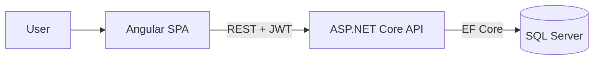

# Vault (Atos Academy final project)

Final project of the Atos Academy C# and .NET bootcamp (2022). A small web app to store and manage login credentials for different software.

## What it does

- Login with JWT; only authenticated users reach the vault.
- Create, list, edit and delete accounts (software, login, password, last update).

## Stack

- **API:** ASP.NET Core (.NET 6), Entity Framework Core 7, SQL Server, JWT, Swagger
- **Front end:** Angular
- **Database:** SQL Server (schema in `vault.sql`)

## Architecture

- `Back/`: REST API with an `accounts` CRUD and an `authenticate` endpoint.
- `Front/`: Angular components for the account list and the add/edit form.

This is a learning project: passwords are stored as plain text, so it is not meant for real credentials.
